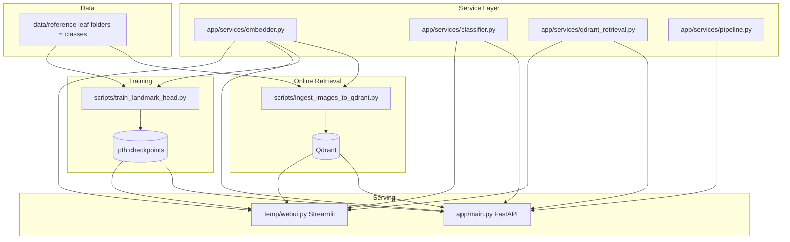

# Malaysia Landmark Recognition

A small Malaysia landmark and food recognition project built on top of **Meta DINOv2** (default: `facebook/dinov2-large`), **Qdrant** vector search, two **linear probe** classifiers, and a minimal **FastAPI** service.

> **FAISS note**: this repository no longer uses FAISS or local IVF/NPY/JSON retrieval. If old FAISS-related files still exist in the working tree, treat them as leftovers. The active retrieval backend is **Qdrant**.

## Overview



## Key Points

- The current training approach is **linear probe / transfer learning**.
- DINOv2 remains the shared feature extractor.
- Qdrant stores DINOv2 embeddings for reference images and serves retrieval results.
- The trained `.pth` files contain **classifier head weights**, not a standalone embedding backbone.
- Retrieval still uses DINOv2 embeddings. The linear probe checkpoints provide classification outputs for the attraction and food branches.

## Data Layout

```text
data/reference/
  attraction/<landmark_class_name>/*.jpg|png|webp|...
  food/<food_class_name>/*.jpg|png|webp|...
```

- Each leaf directory that directly contains images is treated as one class.
- Optional class-level metadata can be stored in `metadata.json`.
- Optional per-image metadata can be stored in a sibling `.json` file and will be merged into the Qdrant payload during ingestion.
- Attraction metadata can also be loaded from `attractions200226.csv`. The CSV is used to enrich payload fields such as `display_name`, `description`, and `location`.
- The embedding step still uses only images. CSV and JSON files are metadata sources only; they do not affect the image vector itself.

## Installation

```bash
python -m venv venv
./venv/bin/pip install -r requirements.txt
```

Run all commands from the repository root.

## Project Structure

| Path | Purpose |
|------|---------|
| `app/main.py` | FastAPI entrypoint. |
| `app/services/embedder.py` | DINOv2 embedding service. |
| `app/services/classifier.py` | Checkpoint loading and classifier prediction helpers. |
| `app/services/qdrant_retrieval.py` | Qdrant retrieval and aggregation helpers. |
| `app/services/pipeline.py` | Shared prediction pipeline for the API. |
| `scripts/train_landmark_head.py` | Trains a linear classifier head for attraction or food. |
| `scripts/ingest_images_to_qdrant.py` | Embeds reference images and writes them into Qdrant. |
| `scripts/pick_eval_images.py` | Copies a small evaluation sample set from `data/reference`. |
| `temp/webui.py` | Streamlit UI for manual testing. |

## Common Commands

### Train Linear Probe Heads

```bash
python scripts/train_landmark_head.py --subset-prefix attraction

python scripts/train_landmark_head.py --subset-prefix food
```

### Ingest Reference Images into Qdrant

```bash
python scripts/ingest_images_to_qdrant.py
```

If needed, point ingestion at a different attraction metadata file:

```bash
python scripts/ingest_images_to_qdrant.py \
  --attractions-csv attractions200226.csv
```

The embedding backbone is now read from `EMBEDDING_MODEL_NAME` and defaults to `facebook/dinov2-large`.

Make sure the same DINO backbone is used everywhere:

- training checkpoints
- Qdrant ingestion
- API inference
- Streamlit inference

### Run FastAPI

```bash
uvicorn app.main:app --reload
```

Default environment variables:

- `ATTRACTION_CHECKPOINT=my_landmark_attraction.pth`
- `FOOD_CHECKPOINT=my_landmark_food.pth`
- `QDRANT_URL=http://localhost:6333`
- `QDRANT_COLLECTION=malaysia_landmarks_dinov2`

### Run Streamlit

```bash
./venv/bin/streamlit run temp/webui.py
```

### Build a Small Eval Set

```bash
python scripts/pick_eval_images.py --per-class 2 --seed 42
```

## Typical Workflow

1. Put reference images under `data/reference/attraction/...` and `data/reference/food/...`.
2. Train the two linear probe heads.
3. Re-ingest Qdrant using the same DINO backbone.
4. Start FastAPI or Streamlit.
5. Test predictions against real user images.

## Main Outputs

| Output | Description |
|--------|-------------|
| `my_landmark_attraction.pth` | Attraction classifier head checkpoint. |
| `my_landmark_food.pth` | Food classifier head checkpoint. |
| Qdrant collection | Reference image vectors plus payload metadata. |

## Notes

- The attraction and food classifier scores should not be compared directly across models.
- A linear probe checkpoint is **not** a replacement backbone.
- If you ever want the trained model itself to produce retrieval embeddings, that would require a different training strategy such as backbone fine-tuning or metric learning.
- GPS-aware lookup now prefers Qdrant native geo filtering on `location: {lat, lon}` and falls back to Python-side distance filtering only for older points that may still carry plain `lat` / `lon` fields.
- New ingested points store a dedicated `location` object instead of separate `lat` and `lon` payload keys.
