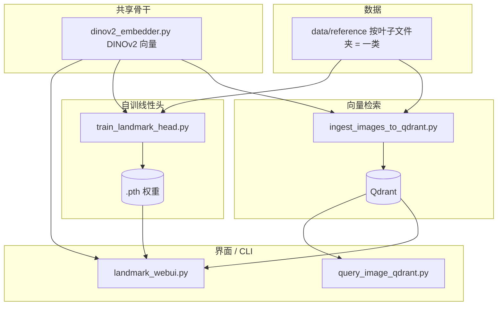

# Malaysia Landmark Recognition

基于 **Meta DINOv2**（`facebook/dinov2-base`）的马来西亚景点 / 食物参考图系统：**Qdrant 向量检索**、可选线性分类头训练、Streamlit 试玩界面。

> **说明（FAISS）**：本人**不再使用 FAISS / 本地 ivf+npy+json 检索**；本 README **不再记录**相关用法。仓库里若仍有 `build_index.py`、`faiss_retrieval.py` 或 `faiss-cpu` 等遗留，**计划后续删除**，请以 **Qdrant** 为准。

## 架构概览



**要点：**

- **没有微调 DINOv2 本体**时：主流程是「固定向量 + Qdrant 检索 / 小线性头」。
- **Qdrant**：全库参考图向量 + payload（`class_path`、`category`、可选 `lat`/`lon` 等）。
- **`.pth`**：仅包含线性层权重 + 类别表；推理仍需加载同名 DINOv2。

## 目录与数据约定

```
data/reference/
  attraction/<景点类名>/*.jpg|png|webp|...
  food/<食物类名>/...
```

- **叶子目录**（直接包含图片的文件夹）= 一个类别。
- 可选：`metadata.json`（按类）、每张图旁 `.json`（ingest 时合并进 Qdrant payload）。

## 环境与安装

```bash
python -m venv venv
./venv/bin/pip install -r requirements.txt
```

**说明**：请在 **仓库根目录** 下执行下文命令（路径、默认输出均相对根目录）。

---

## 脚本一览

| 脚本 | 作用 |
|------|------|
| `dinov2_embedder.py` | 被其它模块 import：加载 HF DINOv2，输出 L2 归一化向量（非独立 CLI）。 |
| `ingest_images_to_qdrant.py` | 扫描 `data/reference`，嵌入后写入本机 Qdrant 集合（默认 `malaysia_landmarks_dinov2`）。 |
| `query_image_qdrant.py` | 命令行：单张图查 Qdrant；可选 `--city`、`--user-lat`/`--user-lon` 等过滤。 |
| `qdrant_retrieval.py` | 被 Web UI import：`query_points` 封装为 `qdrant_topk`（非独立 CLI）。 |
| `train_landmark_head.py` | 冻结 DINOv2，训练线性分类头，产出 `.pth`；支持 `--subset-prefix`、`--router`、`--predict-image`。 |
| `landmark_inference.py` | 加载 `.pth` + 推理：`load_landmark_classifier`、`predict_pil_image`、`query_embedding_from_pil` 等。 |
| `landmark_webui.py` | Streamlit：双细类头 + Qdrant +「最终确认」（Qdrant 优先，router 兜底）。 |
| `augment_reference_images.py` | 对参考图做 Albumentations 增强，输出到指定目录（默认 JPEG）。 |
| `pick_eval_images.py` | 从 `data/reference` 每类随机拷贝若干图到 `data/test/eval_picks/`，写 `manifest.json`。 |

---

## 各脚本用法（命令示例）

### `ingest_images_to_qdrant.py`

需先启动 Qdrant（默认 `http://localhost:6333`）。脚本内可改 `COLLECTION`、`DATA_DIR`、`QDRANT_URL`。

```bash
python scripts/ingest_images_to_qdrant.py
```

### `query_image_qdrant.py`

```bash
python scripts/query_image_qdrant.py --image /path/to/query.jpg
# --city ...  --user-lat ... --user-lon ... --limit 10
```

### `train_landmark_head.py`

```bash
# 全参考库（景点+食物）一个头
python scripts/train_landmark_head.py --out my_landmark.pth

# 仅景点 / 仅食物（减轻 softmax 互相干扰）
python scripts/train_landmark_head.py --subset-prefix attraction --out my_landmark_attraction.pth
python scripts/train_landmark_head.py --subset-prefix food --out my_landmark_food.pth

# 景 / 食二分类路由（Web UI 兜底）
python scripts/train_landmark_head.py --router --out my_landmark_router.pth

# 仅推理打印 Top-K（需已有对应 .pth）
python scripts/train_landmark_head.py --predict-image /path/to.jpg --out my_landmark_attraction.pth
```

`--router` 与 `--subset-prefix` **不能同时使用**。

### `landmark_webui.py`

```bash
./venv/bin/streamlit run scripts/landmark_webui.py
```

侧边栏配置：景点 / 食物 / 路由 `.pth`、Qdrant URL、collection、**最终确认**用的 Qdrant 相似度阈值。

### `augment_reference_images.py`

```bash
python scripts/augment_reference_images.py --help
# 默认从 data/reference 读，写到 data/train
```

### `pick_eval_images.py`

```bash
python scripts/pick_eval_images.py
# --per-class 2  --out-dir data/test/eval_picks  --seed 42
```

---

## 典型工作流

1. **准备参考图**：放入 `data/reference/attraction/...`、`food/...`。
2. **写入 Qdrant**：`python scripts/ingest_images_to_qdrant.py`（参考图更新后需重新 ingest 或增量策略按你后续实现）。
3. **（可选）交付线性头**：按需训练 `my_landmark_attraction.pth`、`my_landmark_food.pth`、`my_landmark_router.pth`。
4. **试用**：`streamlit run scripts/landmark_webui.py`，或 `query_image_qdrant.py` 查单张图。

---

## 主要产出文件

| 文件 / 资源 | 说明 |
|-------------|------|
| `my_landmark*.pth` | `head_state_dict`、`class_paths`、`dinov2_model_name`、`embedding_dim`；路由另含 `router: true`。 |
| Qdrant collection | 点 ID + 向量 + payload（ingest 脚本写入）。 |

---

## 模块依赖关系（简）

- `train_landmark_head.py`、`ingest_images_to_qdrant.py` → `dinov2_embedder.py`（训练脚本另含对 `data/reference` 目录树的扫描逻辑）。
- `landmark_webui.py` → `landmark_inference.py`、`qdrant_retrieval.py`。
- `landmark_inference.py` → `dinov2_embedder.py`。

在 `scripts/` 下运行或通过 `python scripts/xxx.py` 时，脚本会把 `scripts` 加入 `sys.path` 以便相互 import。

---

## 备注

- **食物与景点两个细类头**的 softmax **不可跨列比较**；Web UI 的「最终确认」按 **Qdrant 优先、router 兜底** 规则，见界面内说明。
- 若仅依赖检索、不强制要 `.pth`，可只维护 **Qdrant** 与参考图更新。
