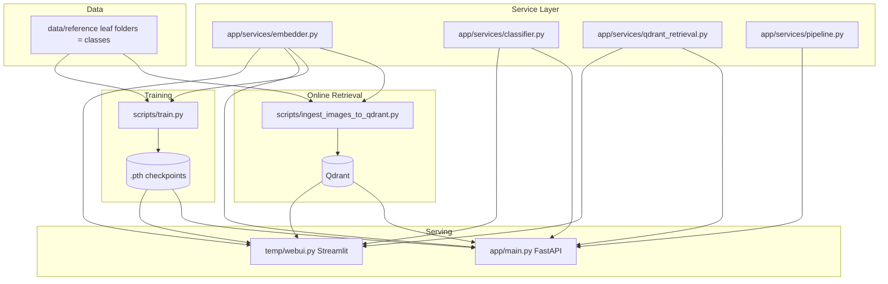

# Malaysia Landmark Recognition

A small Malaysia landmark and food recognition project built on top of **Meta DINOv2** (default: `facebook/dinov2-large`), **Qdrant** vector search, two **linear probe** classifiers, and a minimal **FastAPI** service.

## Contents

- [Overview](#overview)
- [Key Points](#key-points)
- [Deployment Requirements](#deployment-requirements)
- [Data Layout](#data-layout)
- [Local Installation](#local-installation)
- [Project Structure](#project-structure)
- [Operation Guides](#operation-guides)
- [Typical Workflow](#typical-workflow)
- [Main Outputs](#main-outputs)
- [Notes](#notes)

## Overview


```mermaid
flowchart TB
  subgraph data [Data]
    REF[data/reference leaf folders = classes]
  end
  subgraph app [Service Layer]
    DINO[app/services/embedder.py]
    CLS[app/services/classifier.py]
    RET[app/services/qdrant_retrieval.py]
    PIPE[app/services/pipeline.py]
  end
  subgraph online [Online Retrieval]
    ING[scripts/ingest_images_to_qdrant.py]
    QD[(Qdrant)]
    ING --> QD
  end
  subgraph train [Training]
    TL[scripts/train.py]
    PTH[(.pth checkpoints)]
    TL --> PTH
  end
  subgraph serve [Serving]
    API[app/main.py FastAPI]
    WEB[temp/webui.py Streamlit]
  end
  REF --> ING
  REF --> TL
  DINO --> ING
  DINO --> TL
  DINO --> API
  DINO --> WEB
  CLS --> API
  CLS --> WEB
  RET --> API
  RET --> WEB
  PIPE --> API
  QD --> API
  QD --> WEB
  PTH --> API
  PTH --> WEB
```

## Key Points

- The current training approach is **linear probe / transfer learning**.
- DINOv2 remains the shared feature extractor.
- Qdrant stores DINOv2 embeddings for reference images and serves retrieval results.
- The trained `.pth` files contain **classifier head weights**, not a standalone embedding backbone.
- Retrieval still uses DINOv2 embeddings. The linear probe checkpoints provide classification outputs for the attraction and food branches.

## Deployment Requirements

The following specifications are minimum practical baselines for serving predictions. They assume:

- one API container with one Uvicorn worker
- low-to-moderate request volume
- Qdrant is hosted separately
- the server performs inference only, not model training or bulk Qdrant ingestion

| Environment | CPU | RAM | GPU | Free SSD |
|---|---:|---:|---|---:|
| Linux UAT | 4 vCPU minimum, x86_64 | 8 GB | Optional for native CPU execution. If using the supplied Docker Compose configuration unchanged: CUDA-capable NVIDIA GPU with ≥6 GB VRAM | 20 GB |
| Linux production | 8 vCPU minimum, x86_64 | 16 GB | CUDA-capable NVIDIA GPU with ≥8 GB VRAM; 12–16 GB preferred | 50 GB |
| macOS UAT | Apple Silicon, 4+ CPU cores | 16 GB unified memory | Not required; current implementation runs inference on CPU | 20 GB |
| macOS production | Apple Silicon, 8+ CPU cores | 16 GB minimum; 24 GB preferred | Not required; current implementation runs inference on CPU | 50 GB |

Linux with an NVIDIA GPU is the recommended production platform. The supplied `docker-compose.yml` requests an NVIDIA GPU, so it will not run unchanged through Docker Desktop on macOS. The current device selection supports CUDA or CPU; it does not yet select Apple's Metal/MPS backend.

If Qdrant is installed on the same server, add at least 2 CPU cores, 4 GB RAM, and storage appropriate for the vector collection. Training or bulk ingestion should preferably run on a separate machine with at least 32 GB RAM and 12-16 GB GPU VRAM.

### Production Scaling

Scale the API horizontally behind a load balancer. Run one worker in each container and assign one GPU to each container:

```text
Load Balancer
    │
    ├── Container 1 → 1 worker → GPU 1
    ├── Container 2 → 1 worker → GPU 2
    └── Container 3 → 1 worker → GPU 3
```

This prevents multiple worker processes from competing for the same GPU and keeps model memory isolated per container.

The API runs with one Uvicorn worker per container. Scale by adding containers behind the load balancer rather than adding workers inside a container.

## Data Layout

```text
data/reference/
  attraction/<landmark_class_name>/*.jpg|png|webp|...
  food/<food_class_name>/*.jpg|png|webp|...
```

- Each leaf directory that directly contains images is treated as one class.
- Optional class-level metadata can be stored in `metadata.json`.
- Optional per-image metadata can be stored in a sibling `.json` file and will be merged into the Qdrant payload during ingestion.
- Attraction metadata can also be loaded from `attractions.csv`. The CSV is used to enrich payload fields such as `display_name`, `description`, and `location`.
- The embedding step still uses only images. CSV and JSON files are metadata sources only; they do not affect the image vector itself.

## Local Installation

```bash
python -m venv venv
./venv/bin/pip install -r requirements.txt
```

Run all commands from the repository root.

## Project Structure

| Path | Purpose |
|------|---------|
| `app/main.py` | FastAPI entrypoint. |
| `app/services/embedder.py` | DINOv2 embedding service. |
| `app/services/classifier.py` | Checkpoint loading and classifier prediction helpers. |
| `app/services/qdrant_retrieval.py` | Qdrant retrieval and aggregation helpers. |
| `app/services/pipeline.py` | Shared prediction pipeline for the API. |
| `scripts/train.py` | Trains a linear classifier head for attraction or food. |
| `scripts/ingest_images_to_qdrant.py` | Embeds reference images and writes them into Qdrant. |
| `scripts/pick_eval_images.py` | Copies a small evaluation sample set from `data/reference`. |
| `temp/webui.py` | Streamlit UI for manual testing. |

## Operation Guides

### Train Linear Probe Heads

```bash
python scripts/train.py --subset-prefix attraction

python scripts/train.py --subset-prefix food
```

### Ingest Reference Images into Qdrant

```bash
python scripts/ingest_images_to_qdrant.py
```

If needed, point ingestion at a different attraction metadata file:

```bash
python scripts/ingest_images_to_qdrant.py \
  --attractions-csv attractions.csv
```

The embedding backbone is now read from `EMBEDDING_MODEL_NAME` and defaults to `facebook/dinov2-large`.

If your Qdrant deployment requires authentication, set `QDRANT_API_KEY` in the environment. The API service, ingestion script, and Streamlit UI all read the same optional key.

Make sure the same DINO backbone is used everywhere:

- training checkpoints
- Qdrant ingestion
- API inference
- Streamlit inference

### Run FastAPI

```bash
uvicorn app.main:app --reload
```

Or use the short launcher from the repo root:

```bash
python main.py
```

Public routes:

- `GET /health`

Protected API routes:

- `GET /api/v1/`
- `POST /api/v1/predict/`
- `POST /api/v1/predict/upload`
- `GET /api/v1/docs`
- `GET /api/v1/openapi.json`

### Container Deployment

Build the image from the repository root:

Method 1: pass environment variables directly with `docker run` and `docker build`:

```bash
docker build -f docker/Dockerfile -t malaysia-landmark-recognition .
```

```bash
docker run --rm -p 8000:8000 \
  -e QDRANT_URL=http://host.docker.internal:6333 \
  -e QDRANT_API_KEY=your-qdrant-key \
  -e QDRANT_COLLECTION=malaysia_landmarks \
  -e API_KEY=your-secret-key \
  malaysia-landmark-recognition
```

Method 2: use Docker Compose:

```bash
cp .env.example .env
docker compose up -d --build
```

The provided `docker-compose.yml` reads variables from `.env`, requests all visible NVIDIA GPUs, and starts the same API container with one Uvicorn worker.

GPU notes:

- This requires Docker with NVIDIA GPU support on the host.
- The container prints a short CUDA self-check during startup so you can confirm whether `torch` can see the GPU.
- If your Qdrant deployment requires authentication, set `QDRANT_API_KEY`. Leave it empty for local unauthenticated setups.

Startup behavior:

- The container runs `docker/docker-entrypoint.sh`.
- It performs startup smoke checks and prints a CUDA status summary.
- It does not run Qdrant ingestion on startup.
- `docker compose up` is only responsible for starting the API container.

If you want to ingest reference images manually:

```bash
docker compose run --rm api python scripts/ingest_images_to_qdrant.py
```

If you want to force a full rebuild:

```bash
docker compose run --rm api python scripts/ingest_images_to_qdrant.py --rebuild
```


### Run Streamlit

```bash
./venv/bin/streamlit run temp/webui.py
```

### Build a Small Eval Set

```bash
python scripts/pick_eval_images.py --per-class 2 --seed 42
```

## Typical Workflow

1. Put reference images under `data/reference/attraction/...` and `data/reference/food/...`.
2. Train the two linear probe heads.
3. Rebuild Qdrant manually using the same DINO backbone when reference data changes.
4. Start FastAPI or Streamlit.
5. Test predictions against real user images.

## Main Outputs

| Output | Description |
|--------|-------------|
| `my_landmark_attraction.pth` | Attraction classifier head checkpoint. |
| `my_landmark_food.pth` | Food classifier head checkpoint. |
| Qdrant collection | Reference image vectors plus payload metadata. |

## Notes

- The attraction and food classifier scores should not be compared directly across models.
- A linear probe checkpoint is **not** a replacement backbone.
- If you ever want the trained model itself to produce retrieval embeddings, that would require a different training strategy such as backbone fine-tuning or metric learning.
- GPS-aware lookup now uses `location: {lat, lon}` to compute candidate distance and prefer the nearest recognized result when coordinates are available.
- New ingested points store a dedicated `location` object. Radius-based filtering is no longer used.
