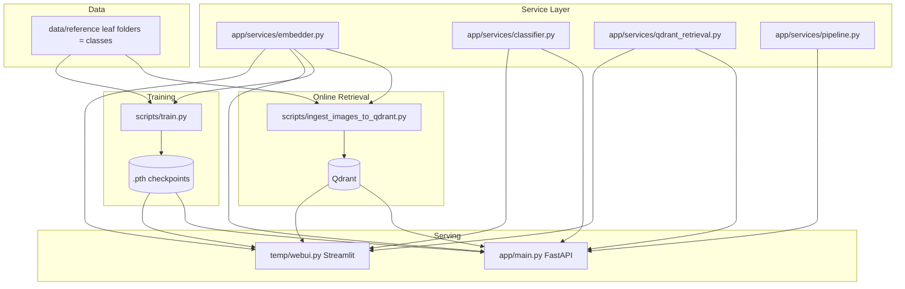

# Malaysia Landmark Recognition

A small Malaysia landmark and food recognition project built on top of **Meta DINOv2** (default: `facebook/dinov2-large`), **Qdrant** vector search, two **linear probe** classifiers, and a minimal **FastAPI** service.

## Overview


```mermaid
flowchart TB
  subgraph data [Data]
    REF[data/reference leaf folders = classes]
  end
  subgraph app [Service Layer]
    DINO[app/services/embedder.py]
    CLS[app/services/classifier.py]
    RET[app/services/qdrant_retrieval.py]
    PIPE[app/services/pipeline.py]
  end
  subgraph online [Online Retrieval]
    ING[scripts/ingest_images_to_qdrant.py]
    QD[(Qdrant)]
    ING --> QD
  end
  subgraph train [Training]
    TL[scripts/train.py]
    PTH[(.pth checkpoints)]
    TL --> PTH
  end
  subgraph serve [Serving]
    API[app/main.py FastAPI]
    WEB[temp/webui.py Streamlit]
  end
  REF --> ING
  REF --> TL
  DINO --> ING
  DINO --> TL
  DINO --> API
  DINO --> WEB
  CLS --> API
  CLS --> WEB
  RET --> API
  RET --> WEB
  PIPE --> API
  QD --> API
  QD --> WEB
  PTH --> API
  PTH --> WEB
```

## Key Points

- The current training approach is **linear probe / transfer learning**.
- DINOv2 remains the shared feature extractor.
- Qdrant stores DINOv2 embeddings for reference images and serves retrieval results.
- The trained `.pth` files contain **classifier head weights**, not a standalone embedding backbone.
- Retrieval still uses DINOv2 embeddings. The linear probe checkpoints provide classification outputs for the attraction and food branches.

## Data Layout

```text
data/reference/
  attraction/<landmark_class_name>/*.jpg|png|webp|...
  food/<food_class_name>/*.jpg|png|webp|...
```

- Each leaf directory that directly contains images is treated as one class.
- Optional class-level metadata can be stored in `metadata.json`.
- Optional per-image metadata can be stored in a sibling `.json` file and will be merged into the Qdrant payload during ingestion.
- Attraction metadata can also be loaded from `attractions.csv`. The CSV is used to enrich payload fields such as `display_name`, `description`, `area`, and `location`.
- The embedding step still uses only images. CSV and JSON files are metadata sources only; they do not affect the image vector itself.

## Area Metadata

Qdrant payloads support an optional `area` string, for example `"mersing"`:

```json
{
  "class_name": "pulau_sibu",
  "class_path": "attraction/pulau_sibu",
  "category": "attraction",
  "display_name": "Pulau Sibu",
  "area": "mersing",
  "location": {"lat": 2.2149, "lon": 104.0531}
}
```

To include `area` during ingestion, add an optional `area` column to the attraction CSV, or put `{"area": "mersing"}` in the class folder's `metadata.json` or an image's sibling JSON file. Metadata precedence is CSV, then class JSON, then image JSON; later sources override earlier values. Area values are preserved as supplied (CSV values have surrounding whitespace removed).

Retrieval carries `area` into raw results and grouped candidates using the best-scoring reference image's payload. Both prediction endpoints (`POST /api/v1/predict/` and `POST /api/v1/predict/upload`) return it in `final_match.area` and each `candidates[].area`, for example:

```json
{
  "name": "Pulau Sibu",
  "category": "attraction",
  "class_path": "attraction/pulau_sibu",
  "similarity": 0.91,
  "reference_hits": 3,
  "area": "mersing",
  "location": {"lat": 2.2149, "lon": 104.0531}
}
```

Streamlit shows an Area column in its candidate and detailed retrieval tables. Existing Qdrant points with `area` work immediately; points without it return `null`. Area is descriptive metadata and does not change similarity scoring, classifier outputs, or GPS distance ranking.

## Installation

```bash
uv venv --python 3.12
uv sync --locked
source .venv/bin/activate
```

Run all commands from the repository root. Install `uv` first. Dependencies are defined in `pyproject.toml` and pinned in `uv.lock`; `requirements.txt` is exported from the lockfile for pip compatibility. After changing dependencies with `uv add`, refresh it with `uv export --locked --no-hashes --no-emit-project -o requirements.txt`.

## Project Structure

| Path | Purpose |
|------|---------|
| `app/main.py` | FastAPI entrypoint. |
| `app/services/embedder.py` | DINOv2 embedding service. |
| `app/services/classifier.py` | Checkpoint loading and classifier prediction helpers. |
| `app/services/qdrant_retrieval.py` | Qdrant retrieval and aggregation helpers. |
| `app/services/pipeline.py` | Shared prediction pipeline for the API. |
| `scripts/train.py` | Trains a linear classifier head for attraction or food. |
| `scripts/ingest_images_to_qdrant.py` | Embeds reference images and writes them into Qdrant. |
| `scripts/pick_eval_images.py` | Copies a small evaluation sample set from `data/reference`. |
| `temp/webui.py` | Streamlit UI for manual testing. |

## Common Commands

### Train Linear Probe Heads

```bash
python scripts/train.py --subset-prefix attraction

python scripts/train.py --subset-prefix food
```

### Ingest Reference Images into Qdrant

```bash
python scripts/ingest_images_to_qdrant.py
```

If needed, point ingestion at a different attraction metadata file:

```bash
python scripts/ingest_images_to_qdrant.py \
  --attractions-csv attractions.csv
```

The embedding backbone is now read from `EMBEDDING_MODEL_NAME` and defaults to `facebook/dinov2-large`.

If your Qdrant deployment requires authentication, set `QDRANT_API_KEY` in the environment. The API service, ingestion script, and Streamlit UI all read the same optional key.

Make sure the same DINO backbone is used everywhere:

- training checkpoints
- Qdrant ingestion
- API inference
- Streamlit inference

### Run FastAPI

```bash
uv run --locked uvicorn app.main:app --reload
```

Or use the short launcher from the repo root:

```bash
python main.py
```

Public routes:

- `GET /health`

Protected API routes:

- `GET /api/v1/`
- `POST /api/v1/predict/`
- `POST /api/v1/predict/upload`
- `POST /api/v1/embed/upload`
- `GET /api/v1/docs`
- `GET /api/v1/openapi.json`

`POST /api/v1/embed/upload` returns just the DINOv2 embedding vector for an uploaded image (`{embedding, dim, model}`) — no Qdrant read or write happens here. It's used by AI-Travel-Buddy's knowledge-base image sync (`app/services/embedding_service.py` there), which already has the area/place/description context from the Laravel admin panel and performs the `image_attraction` upsert itself after calling this endpoint. Reuses the same cached `DinoV2Embedder` instance (`app/services/pipeline.py`'s `get_prediction_bundle()`) as the prediction endpoints, so it adds no extra model-loading cost.

### Run With Docker

Build the image from the repository root:

Method 1: pass environment variables directly with `docker run` and `docker build`:

```bash
docker build -f docker/Dockerfile -t malaysia-landmark-recognition .
```

```bash
docker run --rm -p 8000:8000 \
  -e QDRANT_URL=http://host.docker.internal:6333 \
  -e QDRANT_API_KEY=your-qdrant-key \
  -e QDRANT_COLLECTION=malaysia_landmarks \
  -e API_KEY=your-secret-key \
  malaysia-landmark-recognition
```

Method 2: use Docker Compose:

```bash
cp .env.example .env
docker compose up -d --build
```

The provided `docker-compose.yml` reads variables from `.env`, requests all visible NVIDIA GPUs, and starts the same API container.

GPU notes:

- This requires Docker with NVIDIA GPU support on the host.
- The container prints a short CUDA self-check during startup so you can confirm whether `torch` can see the GPU.
- If your Qdrant deployment requires authentication, set `QDRANT_API_KEY`. Leave it empty for local unauthenticated setups.

Startup behavior:

- The container runs `docker/docker-entrypoint.sh`.
- It performs startup smoke checks and prints a CUDA status summary.
- It does not run Qdrant ingestion on startup.
- `docker compose up` is only responsible for starting the API container.

If you want to ingest reference images manually:

```bash
docker compose run --rm api python scripts/ingest_images_to_qdrant.py
```

If you want to force a full rebuild:

```bash
docker compose run --rm api python scripts/ingest_images_to_qdrant.py --rebuild
```


### Run Streamlit

```bash
uv run --locked streamlit run temp/webui.py
```

### Build a Small Eval Set

```bash
python scripts/pick_eval_images.py --per-class 2 --seed 42
```

## Typical Workflow

1. Put reference images under `data/reference/attraction/...` and `data/reference/food/...`.
2. Train the two linear probe heads.
3. Rebuild Qdrant manually using the same DINO backbone when reference data changes.
4. Start FastAPI or Streamlit.
5. Test predictions against real user images.

## Main Outputs

| Output | Description |
|--------|-------------|
| `my_landmark_attraction.pth` | Attraction classifier head checkpoint. |
| `my_landmark_food.pth` | Food classifier head checkpoint. |
| Qdrant collection | Reference image vectors plus payload metadata. |

## Notes

- The attraction and food classifier scores should not be compared directly across models.
- A linear probe checkpoint is **not** a replacement backbone.
- If you ever want the trained model itself to produce retrieval embeddings, that would require a different training strategy such as backbone fine-tuning or metric learning.
- GPS-aware lookup now uses `location: {lat, lon}` to compute candidate distance and prefer the nearest recognized result when coordinates are available.
- New ingested points store a dedicated `location` object. Radius-based filtering is no longer used.

## Postman model tests

Import [the model test collection](postman/model-tests.postman_collection.json) to check both image classifier heads, embedding retrieval, uploads, and input validation. See [Postman setup instructions](postman/README.md) for variables and the included smoke image.
